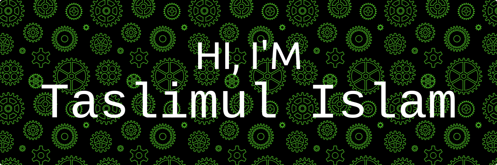

Hey there 👋

I'm Taslim, a passionate and enthusiastic learner on a journey through the world of mobile app development.I'm diving into the fascinating realm of Flutter, eager to craft beautiful and functional applications.When I'm not coding, I love exploring new technologies, sipping coffee, and turning ideas into reality. Let's connect and build something amazing together!

## 📌 Pinned Repositories

 

 

 

<!-- 

 -->

 
 

## &#x1f4c8; GitHub Stats

 

 
 

## 💼 Skills

More Skills

 

 

 

## 📣 How about an Office quote before you go?

> {office_quote}
>
> 
{office_character}

_Quote requested from [The Office API](https://www.officeapi.dev/)_

Check back at the top of the hour for a new quote!

 